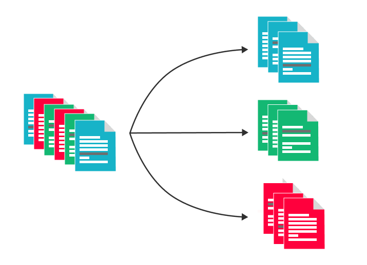

# Image classification


<div align="center">

<a href="">
  
</a>

<h3>Image classification</h4>
</div></div>

----

## Как научить для нового дока:

1. Подготавливаем датасет:
    1. Скачиваем датасет с изображениями из инструмента разметки, подготавливаем разбиения.
    2. Оформляем структуру:
        ```
       <DATASET_DIR>
        ├── train
            ├── <class_name_1>
                ├── <file_name_1>
            ├── <class_name_1>
            └── ...
        ├── validation
        └── test
        ```
    4. Грузим датасет на mleco

2. В директории `configs/` создаём конфиг `<task_name>.yml`. Он полностью наследует `base.yml`, но имеет смысл
   переопределить некоторые его части:
    1. `experiment`

       ```yml
        experiment:
          name: "<your_exp_name>"
          work_dir: "</your/exp/dir>"
        ```

       Выбираем название эксперимента, задаём `seed` и `work_dir`. В `work_dir` создастся следующая структура:

        ```
        <work_dir>/
            └──<exp_name>/
                └──%d.%m/
                    ├──%H.%M.%S/
                    ├──...
        ```

    2. `training.augs`:
        ```yml
        training:
          augs:
            level: <low/high> # пока что пара режимов с разной степенью аугов
        ```
    3. `training.mleco`
         ```yml
        mleco:
            model_name: <model_name>
            dataset_name: <dataset_name>
            dataset_version: <dataset_version>
            dataset_dir: <dataset_dir>
         ```

    4. `model`
        Параметры модели.
        Указываем название модели. Подойдут любые работающие с `timm` и предобученные веса которых загружены в хаб моделей MLECO.

        При необходимости дообучить модель добавляем в конфиг:
          ```yml
         model:
             load_from:
               model_name: document_image_clf
               training_id: 19
               model_dir: "/data/smart_vision/image_clf/models/document_image_clf/19"
               checkpoint_name: best_model.pth
          ```
Теперь можно учить:
  ```
  make train CONFIG=<task_name>.yml
  ```
